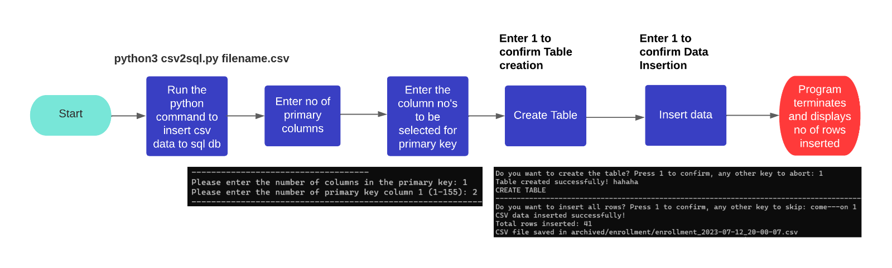
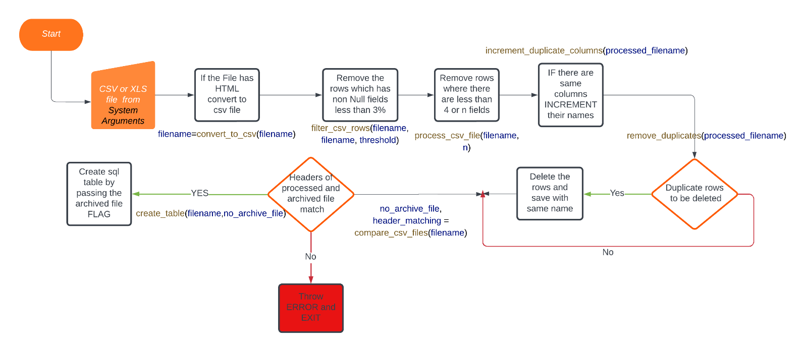
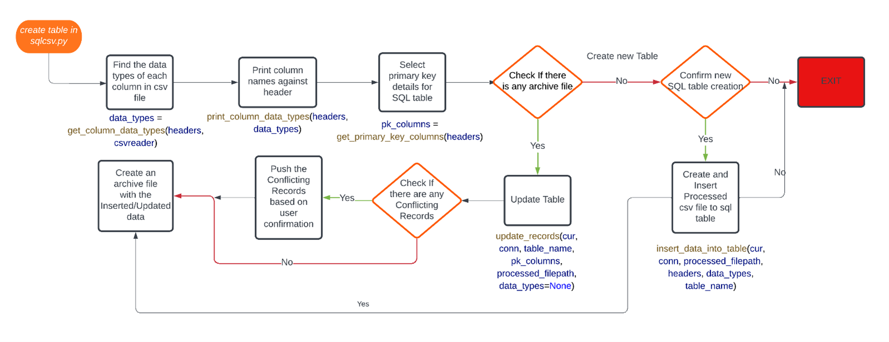
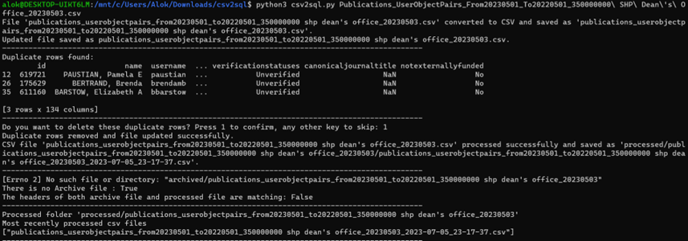
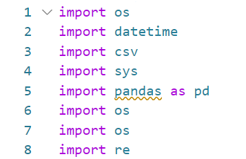

## Table of Contents

1. [Description](#description)
2. [Flow Chart](#flow-chart)
   - [Sequential Flow Chart](#sequential-flow-chart)
   - [Flow Chart 1](#flow-chart-1)
   - [Flow Chart 2](#flow-chart-2)
3. [Installation](#installation)
4. [Step by Step Explanation](#step-by-step-explanation)
5. [Command to connect the PostgreSQL DB](#command-to-connect-the-postgresql-db)
6. [Screen Shots of code execution](#screen-shots-of-code-execution)
7. [Code Explanation](#code-explanation)
8. [Error Handling](#error-handling)

## Description <a name="description"></a>
This repository provides a script (`csv2sql.py`) that facilitates the conversion of CSV or Excel files to PostgreSQL database tables. The script performs data processing, cleaning, table creation, and data insertion/updation.

## Flow Chart <a name="flow-chart"></a>
[Flow Chart]: #flow-chart
### Sequential Flow Chart <a name="sequential-flow-chart"></a>


<p align="center"><b>CSV/Excel to PostgreSQL dB table</b></p>

### Flow Chart 1 <a name="flow-chart-1"></a>

<p align="center"><b>CSV or Excel Pre-processing</b></p>
This flow chart explains the initial process of processing a file to remove noise or unwanted data. It asks for user confirmation and cleans the data, saving it to a processed folder. The processed file is then used to create a SQL table.

### Flow Chart 2 <a name="flow-chart-2"></a>

<p align="center"><b>SQL table creation and data insertion</b></p>
This flow chart builds upon the first flow chart and provides a detailed explanation of SQL table creation, insertion, and updation. It automatically determines the data types of the columns based on the first 100 rows. User input is required to select the primary key columns. If an archive file exists, the SQL table is updated; otherwise, a new table is created.

## Installation for sudo users<a name="installation"></a>

To set up the environment for running the `csv2sql.py` script, follow these steps:

1. Open the Ubuntu server or instance.
2. Run the following commands to install the required packages and dependencies:
   - `sudo apt-get update`
   - `sudo apt-get install nano`
   - `sudo apt-get install python3`
   - `sudo apt-get install python3-pip`
   - `sudo apt-get install postgresql`
   (You might be asked to enter your password to confirm the sudo access)
3. Start the PostgreSQL service:
   - `sudo service postgresql start`
4. Create a PostgreSQL user and database:
   - `sudo -u postgres createuser alok`
   - `sudo -u postgres psql -c "ALTER USER alok WITH PASSWORD 'reddy';"`
   - `sudo -u postgres createdb meddb`
   - `sudo -u postgres psql -c "GRANT ALL PRIVILEGES ON DATABASE meddb TO alok;"`
5. Install the required Python packages by running the following command:
   - `pip3 install -r requirements.txt`
   - You can download the requirements.txt file from the git repo or create a file using below three lines
   -  The contents of **requirements.txt** are  
        **pandas**    
        **psycopg2-binary**  
        **lxml**  
6. Run the script by executing the command:
   - `python3 csv2sql.py filename.csv` (for CSV files)
   - `python3 csv2sql.py filename.xls` (for Excel files)

## Installation for substitute users su<a name="installation2"></a>

To set up the environment for running the `csv2sql.py` script, follow these steps:

1. Open the Ubuntu server or instance.
2. Run the following commands to install the required packages and dependencies:
   - `apt-get update`
   - `apt-get install nano`
   - `apt-get install python3`
   - `apt-get install python3-pip`
   - `apt-get install postgresql`
   (Alternatively, use `sudo` for the commands if you're a sudo user)
3. Start the PostgreSQL service:
   - `service postgresql start` (or `sudo service postgresql start`)
4. Create a PostgreSQL user and database:
   - `su - postgres -c "createuser alok"`
   - `su - postgres -c "psql -c \"ALTER USER alok WITH PASSWORD 'reddy';\""`
   - `su - postgres -c "createdb meddb"`
   - `su - postgres -c "psql -c \"GRANT ALL PRIVILEGES ON DATABASE meddb TO alok;\""`
   (Alternatively, use `sudo -u postgres` for the commands if you're a sudo user)
5. Install the required Python packages by running the following command:
   - `pip3 install -r requirements.txt`
   - You can download the requirements.txt file from the git repo or create a file using below three lines
   -  The contents of **requirements.txt** are  
        **pandas**    
        **psycopg2-binary**  
        **lxml** 
6. Run the script by executing the command:
   - `python3 csv2sql.py filename.csv` (for CSV files)
   - `python3 csv2sql.py filename.xls` (for Excel files)

## Step by Step Explanation<a name="step-by-step-explanation"></a>

1. Have the CSV or Excel files which are to be processed and saved to the database in the same directory as the `csv2sql.py` file.
2. Run the command below for SQL table creation and insertion:
   - Command for CSV: `python3 csv2sql.py filename.csv`
   - Command for Excel: `python3 csv2sql.py filename.xls` or `python3 csv2sql.py filename.xlsx`
   - Command for multiple Excel files in same folder: `python3 final.py` .
     
For example: `python3 make_trimmedcsv.py publications.csv`

3. HTML to CSV:
   - If the data file (CSV or Excel) provided has any HTML content, it will be parsed using BeautifulSoup, and the table will be saved with the same name as the CSV file.
4. Filter CSV rows with a given percentage of non-null fields:
   - The CSV will be processed to remove the rows that have fields less than the given threshold (hardcoded to 3%, but can be changed).
5. Duplicate rows:
   - The script looks for any duplicate rows, and if found, the user will be asked to confirm deleting the repeating records.
6. Process the new CSV file:
   - The new CSV file is processed, and any rows having more than 4 fields (can be changed) are saved to the processed folder.
7. Check for archived folder:
   - The script checks if there is an archived folder with the filename that is processed. If there are any files, it checks the headers. If the headers don't match, the program exits. If there are no files in the archived folder for the processed file, it proceeds with new SQL table creation.
8. Create Primary Key:
   - The first 100 rows in the CSV file are used to determine the data types of the columns. The columns are displayed with numbers for the user to select the primary key.
9. Table Creation:
   - Once the columns are selected, a CREATE query is generated and executed upon user confirmation.
10. Insert Records:
    - The user is then asked for confirmation to insert the records.
11. Update Records:
    - If there are files in the archived folder for the processed file, the script updates the records from the CSV file.
    - It also checks for any conflicting rows and inserts them upon user confirmation.


## Command to connect the PostgreSQL DB <a name="command-to-connect-the-postgresql-db"></a>

The data pushed can be verified by connecting to the PostgreSQL database and running a few select queries.
 - psql -d dbname -U username -W -h hostname -p portnumber  
 - psql -d meddb -U alok -W -h localhost -p 5432  
 - password: reddy  

## Screen Shots<a name="screen-shots-of-code-execution"></a>

### Step 1 to Step 7

<p align="center"><b>Step 1 to Step 7</b></p>

### Step 8

<p align="center"><b>Step 8</b></p>

### Step 9 to Step 11

<p align="center"><b>Step 9 to Step 11</b></p>

## Code Explanation<a name="code-explanation"></a>

The `csv2sql.py` file performs various operations on a CSV file.  

### Importing necessary modules
  
This section imports the required modules for file manipulation, date and time operations, CSV handling, system-related functions, and regular expressions.

### Defining the `trimcsv` function
  
This function reads a file and removes a specified number of lines from the beginning. It then writes the remaining lines back to the same file.

### Defining the `remove_duplicates` function
  
This function uses the pandas library to read a CSV file into a DataFrame. It identifies duplicate rows in the DataFrame, displays them, and prompts the user to confirm whether they want to delete those rows. If confirmed, the duplicate rows are removed, and the modified DataFrame is saved back to the CSV file.

### Defining the `increment_duplicate_columns` function
```python
def increment_duplicate_columns(csv_filename):
```
This function reads a CSV file and performs the following operations:
- Reads the file and stores the data rows in a list.
- Retrieves the header row.
- Counts the occurrences of each processed column name by removing non-alphanumeric characters and extra spaces.
- Modifies column names to make them unique by appending a number to duplicates.
- Writes the modified data (including the updated header row) back to the CSV file.

### Defining the `process_csv_file` function
```python
def process_csv_file(filename, n=4):
    # Check if file exists
    if not os.path.isfile(filename):
        print(f"Error: File '{filename}' does not exist")
        return
    # Rest of the function...
```
This function processes a CSV file based on the provided filename. It takes an optional argument `n` (defaulted to 4) which represents the number of commas to consider for data processing.

The function performs the following steps:
- Reads the input file to find the maximum number of columns (`max_columns`) and the rows with that count (`max_rows`).
- Generates a timestamp for the processed file name.
- Creates a directory structure for the processed files.
- Creates the processed filename based on the original filename and the timestamp.
- Writes a new CSV file with cleaned rows (removes extra spaces and double quotes) based on the specified `n` and `max_columns`.
- Reads the new file, cleans the first row (header row) by removing extra spaces, symbols, and converting to lowercase.
- Writes the modified data back to the CSV file.
- Calls the `increment_duplicate_columns` function to handle duplicate column names.
- Calls the `remove_duplicates` function to remove duplicate rows.
- Prints a confirmation message.

### Handling command-line arguments
```python
if len(sys.argv) < 2:
    print("Error: Please provide the CSV filename as an argument.")
    sys.exit(1)

filename = sys.argv[1]
n = 5  # Default value for n if not provided in sys arguments
num_lines = 0  # Default value for num_lines if not provided in sys arguments

if len(sys.argv) >= 3:
    n = int(sys.argv[2])

if len(sys.argv) >= 4:
    num_lines = int(sys.argv[3])

```
This section handles command-line arguments. The script expects at least one argument, which is the CSV filename. The optional second argument sets the value of `n`, representing the number of commas to consider for processing. The optional third argument sets the number of lines to remove using the `trimcsv` function.


### Calling the `filter_csv_rows` function:
```python
def filter_csv_rows(filename, output_filename, threshold):
```
The `filter_csv_rows` function filters rows in a CSV file based on the threshold of non-null fields percentage. It reads the input file, checks each row's non-null fields percentage, and either includes or skips the row based on the threshold.

### Calling the `create_table` function:
```python
create_table(filename,no_archive_file)
```
We first get the most recent processed file, which is used for table creation. We use a `psycopg2` connection object to connect to the database. The connection object requires the database name, username, password, and port number.
```python
conn = psycopg2.connect(database="meddb", user="alok", password="reddy", host="localhost", port="5432")
```
We now call replace_ordinal_numbers function to remove any ordinal numbers from the column name. Since the table columns shouldn't start with numbers, we use a regex and key mappings for ordinal numbers. They will be replaced with text. 
```python
def replace_ordinal_numbers(column_name):
    # Replace ordinal numbers
    ordinal_mapping = {
        "1st": "first",
        "2nd": "second",
        "3rd": "third",
        "4th": "fourth",
        "5th": "fifth",
        "6th": "sixth",
        "7th": "seventh",
        "8th": "eighth",
        "9th": "ninth"
    }

    # Check if the first character is a digit and then replace numbers without ordinal indicators
    if column_name[0].isdigit():
        column_name = re.sub(r'^(\d+)([a-zA-Z]+)', lambda m: {**{"1": "first", "2": "second", "3": "third", "4": "fourth", "5": "fifth", "6": "sixth", "7": "seventh", "8": "eighth", "9": "ninth"}, **ordinal_mapping}[m.group(1)] + m.group(2), column_name)
    else:
        # Check if the first three letters match an ordinal mapping and replace them
        first_three_letters = column_name[:3]
        if first_three_letters in ordinal_mapping:
            column_name = ordinal_mapping[first_three_letters] + column_name[3:]

    return column_name
```
### Defining the data types of the columns:

We use the first 100 rows in the CSV file to determine the data type of each column. It can be `Decimal`, `Integer`, or `Text`.
```python
data_types = get_column_data_types(headers, csvreader)
```
This information will also be displayed in the proper format, and the user will be asked for primary key selection.
```python
print_column_data_types(headers, data_types)

# Determine the primary key columns
pk_columns = get_primary_key_columns(headers)

```
### Defining the CREATE TABLE query:
```python
create_table_query = f"CREATE TABLE IF NOT EXISTS {table_name} ({', '.join([header.replace('(', '').replace(')', '') + ' ' + data_types[i] for i, header in enumerate(headers)])}, PRIMARY KEY ({pk_constraint}));"
```
```python
cur.execute(create_table_query)
```
The information, such as primary key constraints and column names, which were set in the previous steps, will be used to create the CREATE TABLE query and then executed.

### Inserting data into the table:
```python
insert_data_into_table(cur, conn, processed_filepath, headers, data_types, table_name)
```
We call the `insert_data` function to push the data from the CSV to the created table.
```python
insert_query = sql.SQL("INSERT INTO {table} ({columns}) VALUES %s ON CONFLICT DO NOTHING;").format(
            table=sql.Identifier(table_name),
            columns=sql.SQL(', ').join(map(sql.Identifier, headers_lower))
        )
```
The insert query is created and executed based on user confirmation.
```python
# Create archived folder if it doesn't exist
                if not os.path.exists('archived'):
                    os.makedirs('archived')

                # Create a folder with the name of the CSV file in the archived folder if it doesn't exist
                foldername = os.path.splitext(os.path.basename(filename))[0]
                foldername = foldername.split('_')[0]
                if not os.path.exists(f'archived/{foldername}'):
                    os.makedirs(f'archived/{foldername}')


                # Write the SQL table to a CSV file in the archived folder
                with open(f'archived/{foldername}/{table_name}_{timestamp}.csv', 'w') as csvfile:
                    csvwriter = csv.writer(csvfile)
                    csvwriter.writerow(headers_lower)  # Write lower case column names
                    cur.execute(f"SELECT * FROM {table_name}")
                    rows = cur.fetchall()
                    for row in rows:
                        csvwriter.writerow(row)

```
After successful insertion, the data from the table will be used to create an archive file with the same file name.

### Calling the update function if the archive file is not empty:
```python
query = sql.SQL("INSERT INTO {table} ({columns}) VALUES ({values}) ON CONFLICT ({conflict_columns}) DO NOTHING RETURNING *;").format(
                table=sql.Identifier(table_name),
                columns=sql.SQL(', ').join(map(sql.Identifier, headers)),
                values=sql.SQL(', ').join([sql.Placeholder()] * len(headers)),
                conflict_columns=sql.SQL(', ').join(map(sql.Identifier, pk_columns))
            )

```
We create a query from the CSV and execute it based on user confirmation.

### Checking for any conflicting records:
```python
if conflicting_records:
            print(f"{len(conflicting_records)} conflicting records:")
            for record in conflicting_records:
                print(record)

            print(f"{len(conflicting_records)} conflicting records:")
            # Ask for confirmation before pushing conflicting records
            confirmation = input("Do you want to push the conflicting records to the database? (yes/no): ")
            if confirmation.lower() == "yes":
                # Push conflicting records to the database
                for record in conflicting_records:
                    try:
                        cur.execute(query, record)
                        rows_inserted += 1
                    except psycopg2.IntegrityError:
                        print(f"Failed to insert conflicting record: {record}")
                    else:
                        rows_updated += 1
                print("Conflicting records inserted.")
            else:
                print("Conflicting records not pushed to the database.")

```
If there are any conflicting records, we add them to a separate list, and the user will be asked for confirmation to push them to the database.

We use the same logic as in the insert function to save the updated or pushed file to the archived folder.

## ERROR Handling<a name="error-handling"></a>
### 1. Error while updating the Table:
The following error can occur when the archived folder of the specific file is not empty. This means the table has already been created but deleted later. Errors can occur due to two scenarios:
1. Table is not present in the database, but we are trying to push or update the table.
2. There is an error while processing the CSV file.
```bash
processed/enrollment/enrollment_2023-07-12_19-08-29.csv
Archive file is not empty. Table updation is done
The primary columns are :
[]
Error occurred: syntax error at or near ")"
LINE 1: ...53_level_1', 'Unnamed: 154_level_1') ON CONFLICT () DO NOTHI...

```
<p align="center"><b>Example of scenario 1</b></p>


### How to debug more

We can connect to the PostgreSQL database and check if the table exists.

1. Connect to PostgreSQL database
```psql
psql -d dbname -U username -W -h hostname -p portnumber
psql -d meddb -U alok -W -h localhost -p 5432
password: reddy
```
2.	Check the existing tables in the db
```bash
\d
```
The above command shows all the existing tables  
3.	Check specific table (In our case we are checking the specific table enrollment)
```bash
\d tablename
\d enrollment   
```

### How to fix the problem from local
A simple fix for the above issue is to delete the local files for the specific table in archived folder. This means we are telling the script there is no table created earlier for the specific table.
Move and remove the files pushed earlier in the archived folder.
1.	 Change directory to archived folder
```bash
cd archived  
```
2.	Remove the files of the specific folder in archived directory
```bash
rm -r tablename/
rm -r enrollment/
```  
Here we are removing the folder enrolment recursively so that the script can start with table creation and insertion. (Since we found out there is no table in early steps, the archive file needs to empty so that the data inserting starts with creation).
Now we can rerun the python csv2sql.py enrolment.xls command and everything works fine.

